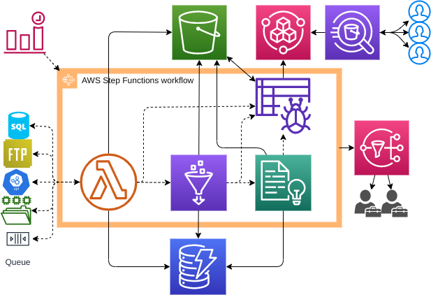
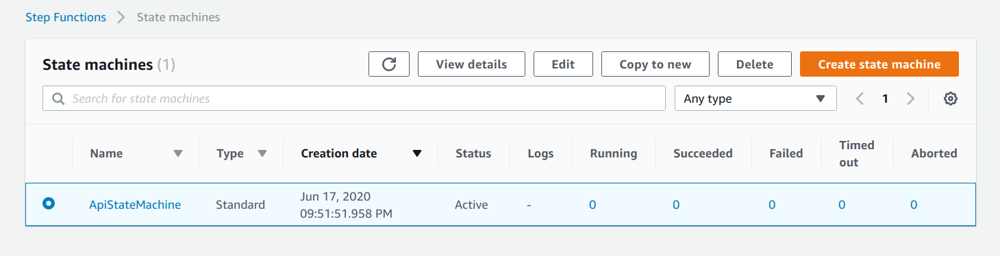

# Serverless Data Pipelines

This repo demonstrates an example of how to utilise Serverless AWS services to construct a modular big data
pipeline. It builds both the architecture required to build a standard enterprise datalake and deploys 
application code for performing ETL.


## Architecture

The architecture follows a standard enterprise big data datalake pattern with layers for business intelligence 
and machine learning.



The demo provisions and deploys the following:

* AWS S3 for data storage
* AWS Lambda scripts (Python) for both sourcing data from public API's and triggering other AWS services
* AWS Glue scripts (Scala) for ETL'ing data into parquet
* AWS Glue crawlers to populate the Glue Data Catalog
* AWS Athena tables for the analytical layer
* AWS Athena views the Business Intelligence layer
* AWS Athena Workgroup for controlling data access
* AWS DynamoDB tables for storing data flow state
* AWS Comprehend for key-value entity extraction
* AWS Step Functions for pipeline orchestration
* AWS CloudWatch for logging
* AWS IAM roles and policies for fine-grained control and access
* AWS KMS keys for data encryption at rest

For this demo it consumes data from a single api (best buy), however the pattern can be scaled out for other 
datasources (api/ftp/sql/etc).


## Prerequisites

* [Terraform > 0.12](https://www.terraform.io/downloads.html)
* [AWS account](https://aws.amazon.com/)


## Build

1. Clone repo: `git clone git@github.com:jhole89/serverless-data-pipelines-demo.git`
2. Initialise terraform: `terraform init`
3. Copy tfvars template: `cp terraform.tfvars.template terraform.tfvars`
4. Fill in `terraform.tfvars` with your AWS account key and [Best Byy API key](https://developer.bestbuy.com/)
5. Apply terraform plan: `terraform apply --auto-approve` - you should see the following output
    ```
    ...
    Apply complete! Resources: 82 added, 0 changed, 0 destroyed.
    ```


## Run
1. Log into your AWS account and head to the Step Functions page, you should now see a recently created state 
machine:

   

2. Runs on a CRON schedule but can also trigger using a test by grabbing the CRON schedule input from the 
`api_manual_trigger` build output.


## Destroy

Once no longer required you can remove all resources:

```shell script
terraform destroy --auto-apply
...
...
Destroy complete! Resources: 82 destroyed.
```
